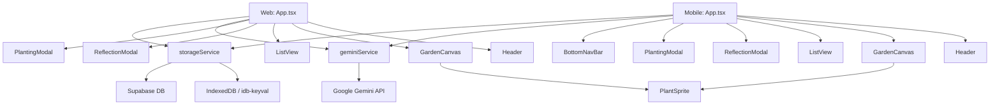

# MindGarden Architecture

This document describes the technical architecture and design decisions behind MindGarden.

## 🏗 High-Level Architecture

MindGarden is available as both a **web application** (React SPA) and a **mobile application** (React Native/Expo) that share core services and data models. Both leverage Google's Gemini 3 Flash and Gemini 3 Pro AI to provide a unique spatial thought-mapping experience.



## 🧩 Core Components

### `App.tsx` (Web & Mobile)
The central controller of the application. It manages:
- **View State**: Switching between Garden and List/Collection views.
- **Thought Logic**: Handling the "planting" (creation) and "watering" (updating) of thoughts.
- **Data Synchronization**: Refreshing the state from the storage service.
- **API Key Management**: Web integrates with AI Studio for key selection; Mobile uses environment variables.

### `Header` (Web & Mobile)
- **Web**: Contains logo, navigation pills (Garden/Collection), and settings button
- **Mobile**: Displays gradient logo and settings icon; navigation moved to BottomNavBar

### `BottomNavBar` (Mobile Only)
Custom bottom navigation with:
- Garden tab (left)
- Central floating "Add" button
- Collection tab (right)

### `GardenCanvas`
A spatial environment where thoughts are positioned based on their category.
- **Spatial Mapping**: Uses a coordinate system to place thoughts in 4 themed zones:
  - **Duties** (Top Left) - `todo` category
  - **Ideas** (Top Right) - `idea` category  
  - **Feelings** (Left/Center) - `feeling` category
  - **Goals** (Bottom Center) - `goal` category
- **Animations**: 
  - Web: Powered by `framer-motion` for smooth transitions
  - Mobile: Native animations with React Native Animated API

### `ReflectionModal`
The primary interaction interface for an individual thought.
- Displays AI-generated reflections and metadata.
- Shows growth timeline with all updates and AI responses.
- Allows "watering" the thought—submitting an update that triggers further AI analysis and advances the plant's growth stage.
- **Mobile**: Full-screen modal with image header and scrollable content

### `ListView` / `Collection`
Grid view with filtering capabilities:
- Filter chips for each category (Idea, Todo, Feeling, Goal)
- **Web**: 3-4 column responsive grid
- **Mobile**: 2 column FlatList with optimized scrolling

## 🤖 Services

### `geminiService.ts`
The AI orchestration layer (shared between web and mobile).
- **`generateMindGardenContent`**: Takes raw user text and returns structured metadata (category, emotion, intensity, metaphors) and a reflection.
- **`waterMindGardenThought`**: Processes updates to existing thoughts, determining if they should advance to the next `GrowthStage` and generating new "Next Steps."

### `storageService.ts`
A hybrid storage layer (shared between web and mobile).
- **IndexedDB**: Primary local storage using `idb-keyval` for fast, offline-capable performance.
- **Supabase**: (Optional) Secondary remote storage for cross-device synchronization.

## 📊 Data Model (`types.ts`)

### `ThoughtCard`
The core object representing a thought "plant."
- `id`: Unique identifier.
- `originalText`: The user's initial input.
- `growthStage`: `seed` | `sprout` | `bloom` | `fruit`.
- `meta`: `ThoughtMeta` containing AI-extracted insights.
- `updates`: Array of `ThoughtUpdate` objects tracking the history of the thought.
- `position`: `{ x, y }` coordinates for garden placement.

### `ThoughtCategory`
Categories have been streamlined to 4 core types:
- `'idea'` - Creative thoughts, inspirations
- `'todo'` - Tasks, duties, responsibilities  
- `'feeling'` - Emotions, worries, reflections (merged from previous worry/feeling split)
- `'goal'` - Aspirations, objectives

### `GrowthStage`
A progression system that visualizes the maturity of a thought through 4 distinct stages, driven by user interaction and AI evaluation.

## 🎨 Design System

### Typography
- **Serif (Headings)**: **Playfair Display** - Elegant, journal-like feel for titles and reflections
- **Sans-serif (Body)**: **Outfit** - Clean, modern readability for UI elements and body text

### Color Palette
Earthy, nature-inspired tones mapped to different thought categories:
- **Stone** (`#292524` - `#f5f5f4`) - Base UI elements
- **Teal** (`#0d9488`) - Primary action color, active states
- **Amber** (`#FCD34D`) - Gradients, accents
- **Rose** (`#FCA5A5`) - Gradients, warm tones
- **Indigo** (`#818CF8`) - Gradients, cool tones

### Animations & Interactions
- **Micro-animations**: Subtle scale and opacity transitions to make the garden feel "alive"
- **Gradient Logo**: Multi-color drop shape (Amber → Rose → Indigo)
- **Web**: Framer Motion for complex enter/exit animations
- **Mobile**: Native performance with React Native's Animated API

## 🗂️ Project Structure

```
MindGarden/
├── components/          # Web React components
├── services/            # Shared AI & storage services
├── types.ts            # Shared TypeScript types
├── App.tsx             # Web root component
├── mobile/             # React Native app
│   ├── components/     # Mobile-specific components
│   ├── services/       # Links to shared services
│   ├── App.tsx         # Mobile root component
│   └── types.ts        # Links to shared types
└── README.md
```
