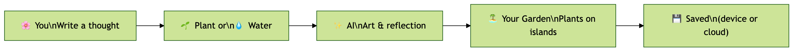
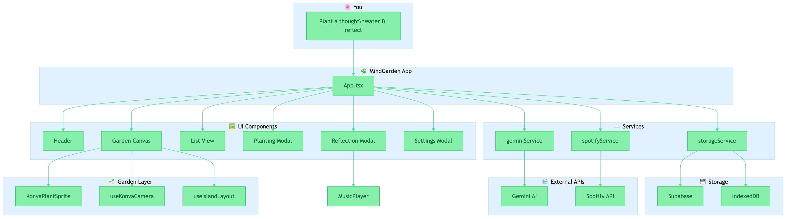
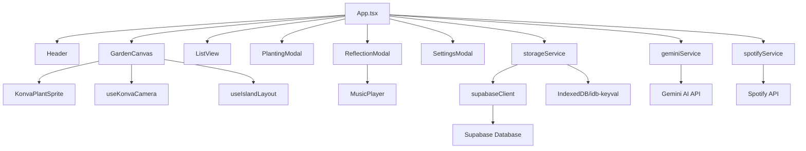

# MindGarden - Technical Documentation

## Table of Contents
- [Project Overview](#project-overview)
- [Architecture](#architecture)
- [Technology Stack](#technology-stack)
- [Core Components](#core-components)
- [Services](#services)
- [Type System](#type-system)
- [Setup & Configuration](#setup--configuration)
- [Development Guide](#development-guide)

---

## Project Overview

### Purpose
MindGarden is an AI-powered reflective journaling application that transforms thoughts into living visual metaphors. Users "plant" thoughts (free-form text); Gemini analyzes them and generates unique botanical imagery and reflective insights. Thoughts grow through four stages (seed, sprout, bloom, mature) as users "water" them with updates.

### Key Features
- **AI-Powered Analysis**: Gemini 3 Flash for thought analysis, reflection generation, and category/emotion tagging (category is inferred by AI: idea, todo, feeling, goal, memory)
- **AI-Generated Imagery**: Unique botanical illustrations via Gemini image model; optional client-side background removal (@imgly/background-removal) for transparent plant art
- **Growth System**: Thoughts evolve through four stages (seed → sprout → bloom → mature) based on watering and AI assessment
- **Visual Garden**: Konva-based canvas with zoom and pan; plants on floating islands in a grid layout (multiple islands, 12 slots per island)
- **Watering/Updates**: Users add updates to thoughts; AI responds and can advance the growth stage, with new imagery when the stage changes
- **Next Step Suggestions**: AI suggests actionable next steps (do, clarify, reflect)
- **Mood-Based Music**: Optional Spotify integration—Gemini suggests a song per thought; Spotify API resolves the track and an embedded player is shown in the reflection modal
- **Hybrid Storage**: Supabase (optional) or local IndexedDB (idb-keyval) as fallback; user-scoped data
- **Responsive Design**: Works on desktop and mobile

### Concept
Botanical growth as a metaphor for thought development:
- **Seed**: Initial thought is planted
- **Sprout**: First reflection begins to emerge
- **Bloom**: Thought develops with updates and insights
- **Mature**: Thought reaches full maturity

---

## Architecture

Two diagrams are available in the repo:

- **User perspective** — simple flow from the user's point of view: [architecture-user-hd.png](architecture-user-hd.png)
- **Technical structure** — components, services, and external APIs: see below and [architecture-hd.png](architecture-hd.png)

### User flow (high level)



### Application Structure (technical)



<details>
<summary>Mermaid source (for editors that render Mermaid)</summary>



</details>

### Data Flow

1. **Planting a Thought**
   ```
   User Input (text) → PlantingModal → geminiService.generateMindGardenContent()
   ↓
   [Gemini: analyze + reflect + image gen + optional background removal + songSuggestion]
   ↓
   [Optional: spotifyService.searchTrack(songSuggestion.query) → music on ThoughtCard]
   ↓
   ThoughtCard (with position from useIslandLayout) → storageService.saveThought()
   ↓
   [Supabase or IndexedDB] → refreshGarden() → UI Update
   ```

2. **Watering a Thought (Update)**
   ```
   User Update → ReflectionModal → geminiService.waterMindGardenThought()
   ↓
   [Gemini: acknowledgment + newStage + optional new image]
   ↓
   Updated ThoughtCard → storageService.saveThought()
   ↓
   Storage → Refresh Garden → UI Update
   ```

### State Management
- **React Hooks**: Uses `useState` and `useEffect` for local state
- **No Global State Library**: Simple prop drilling for data flow
- **Storage as Source of Truth**: Data is loaded from storage on mount and refreshed after mutations

### Storage Strategy
The application uses a **hybrid storage approach**:

1. **Primary**: Supabase (if configured)
   - Cloud-based PostgreSQL database
   - Cross-device synchronization
   - User-scoped data via anonymous UUID

2. **Fallback**: Local IndexedDB (via `idb-keyval`)
   - Browser-local persistence
   - Works offline
   - No setup required

The `storageService` automatically selects the appropriate backend.

---

## Technology Stack

### Core Framework
- **React 19.2.3**: UI library
- **TypeScript 5.8.2**: Type safety
- **Vite 6.2.0**: Build tool and dev server

### UI & Styling
- **TailwindCSS 3.x** (via CDN in `index.html`): Utility-first CSS
- **Framer Motion 12.29.0**: Animations and transitions
- **Lucide React 0.563.0**: Icon library
- **Konva 10.2.0** / **react-konva 19.2.1**: Canvas-based garden (zoom, pan, plant sprites)
- **Google Fonts**: Playfair Display (serif) and Outfit (sans-serif)

### AI & Generation
- **@google/genai 1.38.0**: Gemini API client
  - **gemini-3-flash-preview**: Text analysis, reflection, next steps, song suggestions
  - **gemini-3-pro-image-preview**: Botanical image generation (Imagen)
- **@imgly/background-removal 1.7.0**: Client-side background removal for generated plant images (transparent PNG-style result)

### APIs & External Services
- **Spotify Web API**: Track search for mood-based song recommendations (OAuth Client Credentials flow, token caching)

### Storage
- **@supabase/supabase-js 2.39.0**: Optional cloud database (PostgreSQL)
- **idb-keyval 6.2.1**: IndexedDB wrapper for local storage fallback

### Utilities
- **react-hot-toast 2.6.0**: Notification system

---

## Core Components

### [App.tsx](App.tsx)

**Purpose**: Main application container and orchestrator

**State**:
- `view`: Current view mode (GARDEN or LIST)
- `isPlanting`: Controls PlantingModal visibility
- `isSettingsOpen`: Controls SettingsModal visibility
- `isLoading`: Loading state for async operations
- `selectedThought`: Currently selected thought for detail view
- `gardenThoughts`: Array of all thought cards
- `islandCount`: Number of islands to render (grows when slots fill)
- `hasApiKey`: Whether Gemini API key is available

**Key Functions**:
- `refreshGarden()`: Loads thoughts from storage, runs position migration if needed, updates state
- `handlePlant(text)`: Calls `generateMindGardenContent`, optionally `searchTrack` for music, assigns position via `getNextAvailablePosition`, saves ThoughtCard
- `handleWater(thought, updateText)`: Updates thought via `waterMindGardenThought`, saves and refreshes
- `handleDelete(id)`: Removes thought from storage
- `getNextAvailablePosition()`: Uses `getNextAvailableSlot` and `slotToPosition` from `useIslandLayout`; expands island count when all slots are full

**Island Slot System** (see `hooks/useIslandLayout.ts`):
- 12 slots per island (percent-based positions on a single island SVG)
- Multiple islands in a grid (2 per row); new islands added when current ones are full
- Slot allocation is gap-filling; position migration supports legacy coordinates

### [GardenCanvas.tsx](components/GardenCanvas.tsx)

**Purpose**: Konva-based canvas that renders the garden with zoom and pan

**Features**:
- **Konva Stage/Layer**: Full canvas with configurable world size from `useIslandLayout`
- **Zoom**: Mouse wheel zoom (anchored to cursor), min/max scale via `useKonvaCamera`
- **Pan**: Pointer drag on stage background (not on plants)
- **Island background**: Single island image (`island.svg`) repeated per island; crop region and dimensions from `useIslandLayout`; blend mode multiply for seamless look
- **Plants**: Rendered by `KonvaPlantSprite` at world positions from `thoughtToWorldPosition`
- Empty state and "Sow a New Seed" CTA button (Framer Motion)
- Responsive stage size from container ref

**Layout**:
- Island dimensions and gaps defined in `useIslandLayout` (e.g. `ISLAND_WIDTH`, `ISLAND_HEIGHT`, `ISLAND_GAP`, `ISLANDS_PER_ROW`)
- World size computed by `getWorldSize(islandCount)`

### [ListView.tsx](components/ListView.tsx)

**Purpose**: List view of all thoughts with categorization

**Features**:
- Groups thoughts by category
- Shows growth stage, emotion, and next steps
- Click to open ReflectionModal
- Grid layout on larger screens

### [PlantingModal.tsx](components/PlantingModal.tsx)

**Purpose**: Modal for creating new thoughts

**Features**:
- Single text input for the thought (no category picker—category is inferred by Gemini)
- Loading state during AI generation (with toast)
- Backdrop blur and Framer Motion enter/exit
- Cancel and submit actions

### [ReflectionModal.tsx](components/ReflectionModal.tsx)

**Purpose**: Detailed view of a single thought

**Features**:
- Displays plant image, AI reflection, and metadata (emotion, topic, growth stage)
- Next step card (do / clarify / reflect) when available
- **MusicPlayer**: Optional embedded Spotify track and AI reasoning when `thought.music` is set
- Growth log: original thought plus timeline of updates with AI responses
- Watering form at bottom (for thoughts not yet mature)
- Delete button and creation date in footer

**UI Design**:
- Single-column card layout; circular plant image with gradient
- Framer Motion layout and AnimatePresence

### [SettingsModal.tsx](components/SettingsModal.tsx)

**Purpose**: Configuration panel for Supabase

**Features**:
- Input for Supabase URL and API key
- Save/clear functionality
- Updates `supabaseClient` configuration

### [KonvaPlantSprite.tsx](components/KonvaPlantSprite.tsx)

**Purpose**: Renders a single plant on the Konva canvas

**Features**:
- Uses `thoughtToWorldPosition(thought)` for placement in world coordinates
- Plant image loaded and cached; size varies by `growthStage` (seed smallest, mature largest)
- Konva Group with entry animation (scale/opacity tween) and optional floating bob
- Growth stage indicator (colored ellipse) and "New" badge (Text) when `!thought.hasViewed`
- Click handler to open ReflectionModal; hover state for feedback
- Memoized to avoid unnecessary re-renders

**Note**: `PlantSprite.tsx` exists for non-Konva use (e.g. DOM-based layouts); the main garden uses `KonvaPlantSprite`.

### [MusicPlayer.tsx](components/MusicPlayer.tsx)

**Purpose**: Displays the optional Spotify recommendation for a thought

**Features**:
- Renders only when `thought.music` (SongRecommendation) is present
- Shows song name, artist, and AI reasoning (why the song fits)
- Embedded Spotify iframe player (track preview)
- Link to open in Spotify app/web
- Gradient card styling consistent with the app

### [Header.tsx](components/Header.tsx)

**Purpose**: Top navigation bar

**Features**:
- App title and branding
- View switcher (Garden ⇄ List)
- Settings button
- Glassmorphic design

---

## Services

### [geminiService.ts](services/geminiService.ts)

**Purpose**: AI integration for content generation, analysis, and image processing

#### Configuration
```typescript
const TEXT_MODEL = "gemini-3-flash-preview";
const IMAGE_MODEL = "gemini-3-pro-image-preview";
// Image generation uses aspectRatio "1:1", imageSize "1K"
```

#### Main Functions

##### `generateMindGardenContent(text: string): Promise<GeneratedContent & { songSuggestion }>`
Creates a new thought with AI analysis and imagery.

**Process**:
1. Calls `analyzeTextAndReflect(text)` for metadata (includes `songSuggestion: { query, reasoning }`)
2. Calls `generateBotanyImage()` for seed-stage plant image (category/emotion-driven)
3. Image pipeline: Gemini generates image → optional `removeBackground(dataUri)` for transparency
4. Returns `GeneratedContent` plus `songSuggestion` (consumed by App to call Spotify)

**Returns**:
- `imageUrl`, `reflection`, `meta` (ThoughtMeta)
- `songSuggestion`: `{ query: string, reasoning: string }` for Spotify search

##### `removeBackground(dataUri: string): Promise<string>`
Runs client-side background removal on a data URI image using `@imgly/background-removal`. Used inside `generateBotanyImage` after Gemini returns the image; on failure, the original data URI is returned.

##### `waterMindGardenThought(thought: ThoughtCard, updateText: string): Promise<WateringResponse>`
Updates an existing thought and potentially advances growth stage.

**Process**:
1. Analyzes update in context of original thought and history
2. Determines new growth stage
3. Generates new image if stage advances
4. Returns acknowledgment and updated data

**Returns**:
```typescript
{
  acknowledgment: string,     // AI response to update
  newStage: GrowthStage,      // Updated stage
  hasNextStep: boolean,       // Whether next step exists
  nextStep: NextStep | null,  // Action suggestion
  newImageUrl?: string        // New image if stage changed
}
```

#### Helper Functions

##### `analyzeTextAndReflect(userText: string): Promise<AnalysisResponse>`
Analyzes user input using structured output schema.

**Structured Output Schema**:
- `emotion`, `intensity`, `reflection`, `category` (ThoughtCategory), `topic`
- `hasNextStep`, `nextStep` (text, type: do/clarify/reflect, confidence)
- `songSuggestion`: `{ query: string, reasoning: string }` for Spotify

##### `generateBotanyImage(stage, emotion, category)`
Generates botanical imagery using the Gemini image model. Uses `PLANT_SPECIES` (category → plant name and stage descriptions). After generation, runs `removeBackground()` for transparency; on failure keeps original image.

**Error Handling**:
- Retry with backoff for overload/503; timeout for long runs
- Image failure fallback (e.g. placeholder); background removal failure keeps original

##### `getClient()`
Returns configured Gemini client using `process.env.API_KEY` / `GEMINI_API_KEY` (inlined by Vite).

---

### [spotifyService.ts](services/spotifyService.ts)

**Purpose**: Spotify Web API integration for mood-based song recommendations

**Configuration**: Uses `process.env.SPOTIFY_CLIENT_ID` and `process.env.SPOTIFY_CLIENT_SECRET` (inlined by Vite).

**Functions**:
- **getSpotifyAccessToken()**: Client Credentials flow; caches token and refreshes before expiry
- **searchTrack(query, reasoning?)**: Searches Spotify for a track, returns `SongRecommendation | null` (trackId, name, artist, albumArt, previewUrl, spotifyUrl, reasoning). Used by App after `generateMindGardenContent` when `songSuggestion.query` is present. Failures are non-blocking (thought is still saved without music)

---

### [storageService.ts](services/storageService.ts)

**Purpose**: Hybrid data persistence layer

#### Storage Keys
```typescript
const STORAGE_KEY = 'mindgarden_thoughts_v1';
const USER_ID_KEY = 'mindgarden_user_id';
```

#### Exported Functions

##### `saveThought(thought: ThoughtCard): Promise<void>`
Saves or updates a thought card.

**Logic**:
- Checks if Supabase is configured
- Routes to `saveToSupabase()` or `saveToLocal()`
- Handles errors and throws

##### `getThoughts(): Promise<ThoughtCard[]>`
Retrieves all thoughts for current user.

**Logic**:
- Attempts Supabase first
- Falls back to local storage on error
- Returns empty array if both fail

##### `deleteThought(id: string): Promise<void>`
Deletes a thought by ID.

#### Supabase Implementation

**Schema** (assumed):
```sql
Table: thoughts
- id: text (primary key, matches ThoughtCard.id)
- user_id: text (anonymous UUID)
- data: jsonb (entire ThoughtCard object)
- created_at: bigint (timestamp)
```

**User ID**: Generated UUID stored in localStorage, scopes all queries

#### Local Storage Implementation
Uses `idb-keyval` for IndexedDB storage:
- Single key: `mindgarden_thoughts_v1`
- Value: Array of ThoughtCard objects
- Updates merge by ID

---

### [supabaseClient.ts](services/supabaseClient.ts)

**Purpose**: Supabase client initialization and configuration

#### Configuration Sources
1. Environment variables: `process.env.SUPABASE_URL`, `process.env.SUPABASE_KEY`
2. LocalStorage: User-configured values from SettingsModal

#### Exported Functions

##### `getSupabase(): SupabaseClient | null`
Returns singleton Supabase client or null if not configured.

##### `updateSupabaseConfig(url: string, key: string)`
Updates configuration and recreates client.

##### `getStoredConfig()`
Returns current URL and key from storage or env.

---

## Type System

### Core Types ([types.ts](types.ts))

#### Enums and Literals

```typescript
type ThoughtCategory = 'idea' | 'todo' | 'feeling' | 'goal' | 'memory';
type NextStepType = 'do' | 'clarify' | 'reflect';
type GrowthStage = 'seed' | 'sprout' | 'bloom' | 'mature';

enum AppView {
  GARDEN = 'GARDEN',
  LIST = 'LIST'
}
```

#### Interfaces

##### `NextStep`
```typescript
interface NextStep {
  text: string;           // Action suggestion text
  type: NextStepType;     // Category of action
  confidence: number;     // AI confidence (0-1)
}
```

##### `ThoughtMeta`
```typescript
interface ThoughtMeta {
  emotion: string;              // Dominant emotion
  intent?: string;              // Legacy field (optional)
  intensity: 'low' | 'medium' | 'high';
  metaphors: string[];          // Legacy field
  plantSpecies: string;         // Visual consistency identifier
  category: ThoughtCategory;
  topic: string;                // Short label (3-6 words)
  hasNextStep: boolean;
  nextStep: NextStep | null;
}
```

##### `GeneratedContent`
```typescript
interface GeneratedContent {
  imageUrl: string;       // Data URL of plant image
  reflection: string;     // AI-generated reflection
  meta: ThoughtMeta;
}
```

##### `Position`
```typescript
interface Position {
  x: number;  // Percentage 0-100 (with island offset)
  y: number;  // Percentage 0-100
}
```

##### `ThoughtUpdate`
```typescript
interface ThoughtUpdate {
  id: string;
  timestamp: number;
  text: string;                   // User's update
  aiResponse: string;             // AI acknowledgment
  previousStage: GrowthStage;
  newStage: GrowthStage;
  nextStep?: NextStep | null;
}
```

##### `WateringResponse`
```typescript
interface WateringResponse {
  acknowledgment: string;
  newStage: GrowthStage;
  hasNextStep: boolean;
  nextStep: NextStep | null;
  newImageUrl?: string;  // Present if stage changed
}
```

##### `SongRecommendation`
```typescript
interface SongRecommendation {
  trackId: string;       // Spotify track ID
  name: string;
  artist: string;
  albumArt?: string;
  previewUrl?: string;
  spotifyUrl: string;
  reasoning?: string;    // AI reasoning for the suggestion
}
```

##### `ThoughtCard` (Main Data Model)
```typescript
interface ThoughtCard extends GeneratedContent {
  id: string;
  originalText: string;
  createdAt: number;
  position: Position;
  hasViewed: boolean;
  growthStage: GrowthStage;
  updates: ThoughtUpdate[];
  music?: SongRecommendation;  // Optional, from Spotify after songSuggestion
}
```

---

## Setup & Configuration

### Prerequisites
- **Node.js** (version 18+ recommended)
- **Gemini API Key** from [AI Studio](https://aistudio.google.com)
- **Supabase Project** (optional, for cloud storage)
- **Spotify App** (optional, for mood-based music; create at [Spotify Developer Dashboard](https://developer.spotify.com/dashboard))

### Installation

1. **Clone the repository**:
   ```bash
   git clone <repository-url>
   cd MindGarden
   ```

2. **Install dependencies**:
   ```bash
   npm install
   ```

3. **Configure environment variables** (e.g. in `.env`):
   
   **Required for core features**:
   ```bash
   GEMINI_API_KEY=your_api_key_here
   ```
   
   The app also checks for an API key via the AI Studio browser extension when running in AI Studio.
   
   **Optional — Supabase** (cloud sync):
   ```bash
   SUPABASE_URL=your_supabase_url
   SUPABASE_KEY=your_supabase_anon_key
   ```
   Alternatively, configure via the Settings modal in the app.
   
   **Optional — Spotify** (music recommendations):
   ```bash
   SPOTIFY_CLIENT_ID=your_client_id
   SPOTIFY_CLIENT_SECRET=your_client_secret
   ```
   If not set, thoughts are still planted and saved; they simply won’t have an associated song.
   
   **Supabase schema** (when using cloud storage):
   ```sql
   CREATE TABLE thoughts (
     id TEXT PRIMARY KEY,
     user_id TEXT NOT NULL,
     data JSONB NOT NULL,
     created_at BIGINT NOT NULL
   );
   CREATE INDEX idx_thoughts_user_id ON thoughts(user_id);
   ```

### Running Locally

```bash
npm run dev
```

Access at `http://localhost:5173` (or port shown in terminal)

### Building for Production

```bash
npm run build
```

Output in `dist/` directory.

### Preview Production Build

```bash
npm run preview
```

---

## Development Guide

### Project Structure

```
MindGarden/
├── components/
│   ├── GardenCanvas.tsx     # Konva canvas, zoom/pan, island + plants
│   ├── GardenGrid.tsx       # (Reserved / placeholder)
│   ├── Header.tsx
│   ├── KonvaPlantSprite.tsx # Plant sprite on Konva canvas
│   ├── ListView.tsx
│   ├── MusicPlayer.tsx      # Spotify embed + reasoning for thought.music
│   ├── PlantingModal.tsx
│   ├── PlantSprite.tsx      # DOM-based plant (e.g. for alternate layouts)
│   ├── ReflectionModal.tsx
│   ├── SettingsModal.tsx
│   ├── ThoughtInput.tsx     # (Reserved / placeholder)
│   └── ThoughtResult.tsx    # (Reserved / placeholder)
├── hooks/
│   ├── useIslandLayout.ts   # Slot system, world size, position helpers
│   └── useKonvaCamera.ts    # Zoom, pan, animateZoomOut for Konva Stage
├── services/
│   ├── geminiService.ts     # Gemini text + image + removeBackground
│   ├── spotifyService.ts    # Spotify auth + track search
│   ├── storageService.ts
│   └── supabaseClient.ts
├── App.tsx
├── index.tsx
├── types.ts
├── index.html              # Tailwind CDN, fonts, theme
├── island.svg              # Island background (cropped in layout)
├── vite.config.ts          # Env define for API keys
├── package.json
└── .env                    # Gitignored; GEMINI_API_KEY, optional Supabase/Spotify
```

### Key Patterns

#### Adding a New Component
1. Create file in `components/` directory
2. Define props interface
3. Use Framer Motion for animations
4. Import into `App.tsx` and wire up state/handlers

#### Extending Thought Metadata
1. Update `ThoughtMeta` interface in `types.ts`
2. Update structured output schema in `geminiService.ts`
3. Adjust UI components to display new fields

#### Customizing AI Prompts
- Edit system prompts in `geminiService.ts`
- Adjust structured output schemas for different metadata
- Modify image generation prompts for different visual styles

#### Styling Guidelines
- Use Tailwind utility classes
- Custom colors defined in `index.html` Tailwind config:
  - `paper`: #FDFCF8 (off-white background)
  - `ink`: #4A4646 (text color)
  - `dream.*`: Pastel palette for accents
- Font families: `font-serif` (Playfair Display), `font-sans` (Outfit)

### Common Tasks

#### Changing Growth Stages
Modify `GrowthStage` in `types.ts` and update:
- `PLANT_SPECIES` and stage descriptions in `geminiService.ts`
- Image prompts in `generateBotanyImage()`
- `getPlantSize()` in `KonvaPlantSprite.tsx` and any stage indicators in UI

#### Adjusting Island Layout
- Edit `ISLAND_SLOTS`, `ISLAND_WIDTH`, `ISLAND_HEIGHT`, `ISLAND_GAP`, `ISLANDS_PER_ROW` in `hooks/useIslandLayout.ts`
- Slot positions are percentages relative to the full island SVG; migration for old positions is in `migratePosition()`

#### Adding New Thought Categories
1. Update `ThoughtCategory` in `types.ts`
2. Add an entry to `PLANT_SPECIES` in `geminiService.ts` (name + stage descriptions)
3. Category is inferred by Gemini; no PlantingModal category selector in the current UI

---

## API Reference

### Gemini AI Usage

#### Models Used
- **gemini-3-flash-preview**: Text (analysis, reflection, next steps, song suggestion)
- **gemini-3-pro-image-preview**: Image generation (botanical art); output then optionally passed through background removal

#### Rate Limiting
- Retry logic with exponential backoff (up to 2 retries)
- Delays of 1000ms between retries

#### Error Handling
- Network errors: Retry with backoff
- Image generation failures: Fallback to SVG placeholder
- API key errors: Show unlock screen

### Storage API

All storage operations return `Promise<void>` or `Promise<ThoughtCard[]>`.

```typescript
// Save or update
await saveThought(thoughtCard);

// Retrieve all
const thoughts = await getThoughts();

// Delete
await deleteThought(thoughtId);
```

### Framer Motion Animations

Common patterns used:

```typescript
// Layout animations
<motion.div layoutId={thought.id}>

// Entrance/exit
<motion.div 
  initial={{ opacity: 0, scale: 0.9 }}
  animate={{ opacity: 1, scale: 1 }}
  exit={{ opacity: 0, scale: 0.9 }}
>

// Hover effects
<motion.button
  whileHover={{ scale: 1.05 }}
  whileTap={{ scale: 0.95 }}
>
```

---

## Troubleshooting

### Common Issues

**Problem**: "API Key required" error  
**Solution**: Ensure `GEMINI_API_KEY` is set in `.env` file or available via AI Studio

**Problem**: Thoughts not persisting  
**Solution**: Check browser console for storage errors. Verify Supabase config or check IndexedDB in browser DevTools

**Problem**: Images not generating  
**Solution**: Check API key permissions for Imagen model. Fallback SVG should still appear.

**Problem**: Garden layout looks misaligned  
**Solution**: Verify `island.svg` aspect ratio is 3:2. Check that plant positions are percentages 0-100.

---

## Future Enhancements

Potential areas for extension:
- User authentication (replace anonymous UUID)
- Sharing thoughts or export (e.g. image/PDF)
- Custom plant species or theme selection
- Seasonal or time-of-day visual tweaks
- Reminders / “water your garden” nudges
- Richer personalization (reflection tone, music filters)
- Mobile app (React Native) or PWA
- Multiple gardens or collections
- Community “seed packs” or read-only public gardens

---

## License

This project is part of AI Studio. Refer to the main repository for license information.

---

## Support

For issues or questions:
- Check the [GitHub Issues](https://github.com/user/mindgarden/issues)
- Review Gemini API documentation at [ai.google.dev](https://ai.google.dev)
- Supabase documentation at [supabase.com/docs](https://supabase.com/docs)
